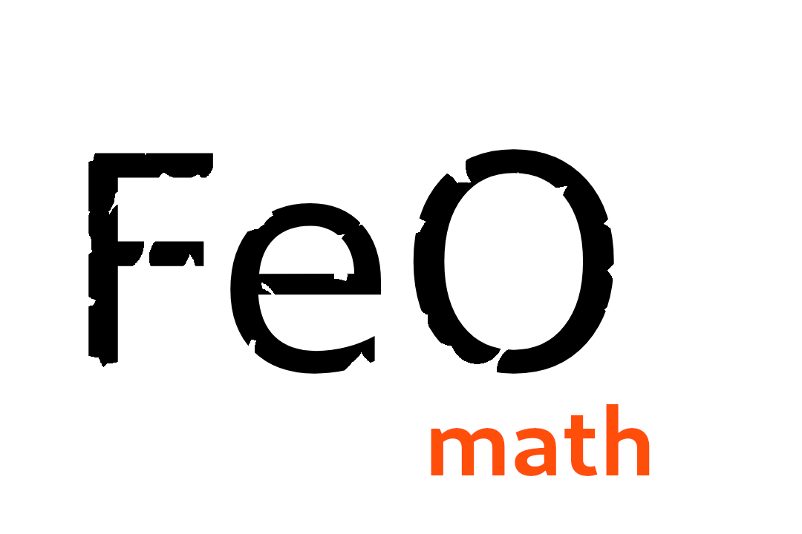

# [FeO Math](https://github.com/littleTitan/feo-math) <!-- (https://feo-math.rs) -->

[](https://crates.io/crates/feo-math)
[](https://docs.rs/feo-math)
[](https://github.com/littleTitan/feo-math/actions?query=workflow%3ARust)

see also: [feo-oop-engine](https://github.com/littleTitan/feo-oop-engine)

## Description

> Feo Math is a library I created to help me learn linear algebra and spacial rotation. This is my own undertaking through and through.

Feo Maths intended purpose was to serve as the math library for the [feo-oop-engine](https://github.com/littleTitan/feo-oop-engine) a 3D engine made with rust.

## Structure
Within the crate there are the following useful modules:
+ a **`linear_algebra`** module, intended to support all matrix and vector arithmetic with square matrices and vectors 3 and 4 units long;
+ a **`rotation`** module, intended to support the math behind spacial rotation;
+ and a **`utils`** module intended to support the added utility of a [`Space`](##Space).

These modules all implement `Construct` which ensures that certain mathematical operations can be performed on them all.

## Space
A space is an area in which objects, such as spaces or the vertices of a mesh, can exist. An issue with this visualization is however that the area itself is unlimited in size. If a space is translated, rotated, or scaled the objects within it do not change their position, rotation, or scaling relative to the space. Their position relative to the space containing that space however will change. 

> Spaces can also be joined to represent conversions between spaces.

Standard spaces include:
 + Worldspace : The space in which all objects exist without their own space and any spaces containing their own space.
 + Viewspace : The space the viewer perceives viewed objects in
 + Cameraspace : The position relative to the camera. NOT the viewspace.
 + Objectspace : every game-object has its own space


## References
+ [Wikipedia Matrix mathematics](https://en.wikipedia.org/wiki/Matrix_(mathematics))
+ [Wikipedia Rotation Matrix](https://en.wikipedia.org/wiki/Rotation_matrix)
+ [Wikipedia Quaternion](https://en.wikipedia.org/wiki/Quaternion)
+ [Wikipedia Quaternions and spacial rotation](https://en.wikipedia.org/wiki/Quaternions_and_spatial_rotation)
+ [Rotors](https://marctenbosch.com/quaternions/) <!-- the irony -->

# License 
```LICENSE
MIT License

Copyright (c) 2021 Lucas Ballmer

Permission is hereby granted, free of charge, to any person obtaining a copy of this software and associated documentation files (the "Software"), to deal in the Software without restriction, including without limitation the rights to use, copy, modify, merge, publish, distribute, sublicense, and/or sell copies of the Software, and to permit persons to whom the Software is furnished to do so, subject to the following conditions:

The above copyright notice and this permission notice shall be included in all copies or substantial portions of the Software.

THE SOFTWARE IS PROVIDED "AS IS", WITHOUT WARRANTY OF ANY KIND, EXPRESS OR IMPLIED, INCLUDING BUT NOT LIMITED TO THE WARRANTIES OF MERCHANTABILITY, FITNESS FOR A PARTICULAR PURPOSE AND NONINFRINGEMENT. IN NO EVENT SHALL THE AUTHORS OR COPYRIGHT HOLDERS BE LIABLE FOR ANY CLAIM, DAMAGES OR OTHER LIABILITY, WHETHER IN AN ACTION OF CONTRACT, TORT OR OTHERWISE, ARISING FROM, OUT OF OR IN CONNECTION WITH THE SOFTWARE OR THE USE OR OTHER DEALINGS IN THE
SOFTWARE.
```
